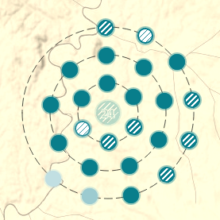
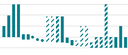
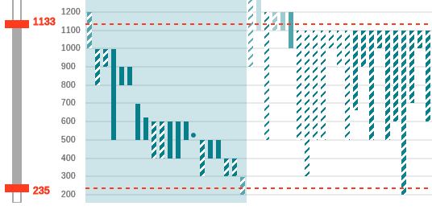
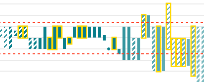

# Manual

A brief documentation about visualisation methods and interaction possibilities implemented in the application. Two main entry points to data are provided: the *map field* and the *timeline*. Both are interactive and interconnected, so the changes in map are reflected in timeline and vice versa. Application maintains visual correspondence between the two, though there are some specifics to each part. 

# Visualisation in the map

Besides the geographic position signs on the map denote the following properties of baptisteries:  

- *spatial uncertainty* (unclear coordinates) is visualised as a halo around the sign

- *time selection* is visualised as a colour shade on the scale from turquoise to gray, turquoise meaning the baptistery certainly falls in the selected time interval, the more gray the farther from the time interval
- *certainty of the object being a baptistery* is visualised by various hatching density

Furthermore, signs are clustered to avoid visual clutter where signs are in conflict. The cluster is assigned the average of member's properties and is visualised as such. The number of members is also displayed. The level of clustering depends on the zoom level, you can also view the group members by clicking on the cluster.

# Visualisation in the timeline

Baptisteries are also displayed as bars on the timeline, the following properties are visualised the same way as on the map:

- *time selection* as color
- *certainty of the object being a baptistery* as hatching 

In addition to that:

- *date uncertainty* is displayed and the vertical length of the bar in the timeline
- *existence in the current map view* is visualised as a transparent background block

# Timeline ordering

Elements on the timeline are ordered from right to left by the following properties in this order of precedence:

- first, by existence in the current map view
- second, by the membership in the current time interval properties
- third, by the *timeline ordering* property adjustable in the UI

# Additional filtering in the UI

The UI allows filtering by additional parameters associated with baptisteries. There are two display modes available:

- selected elements are either highlighted by yellow outline both in map and in the timeline 
- or the non-matching baptisteries are removed from both views

